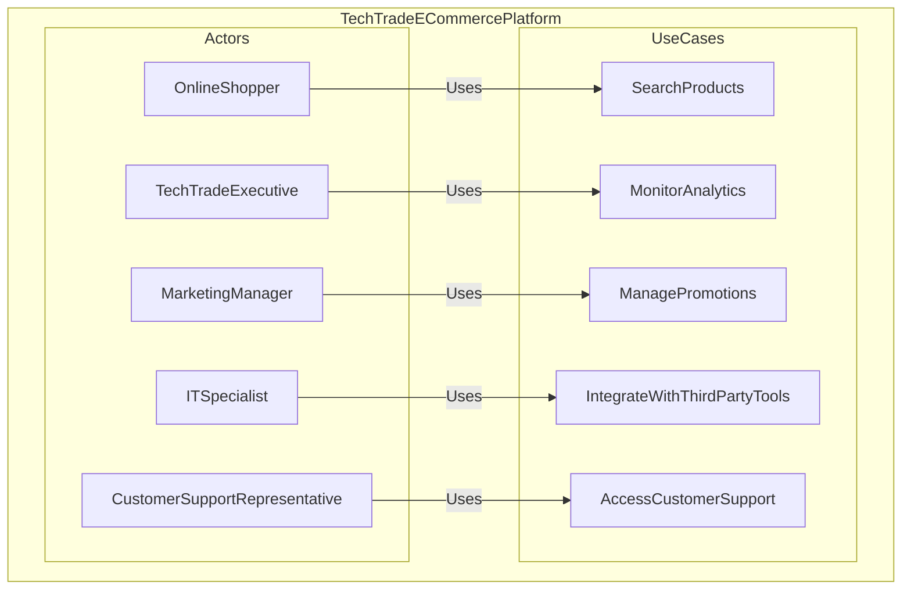
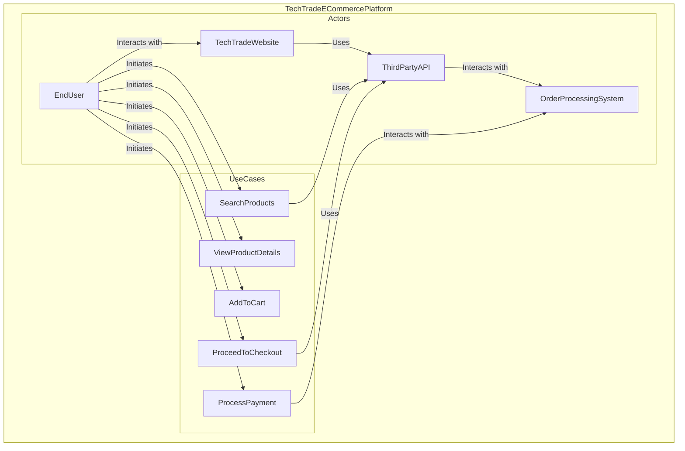
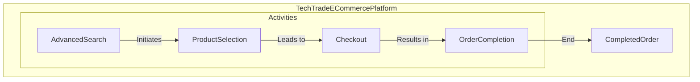
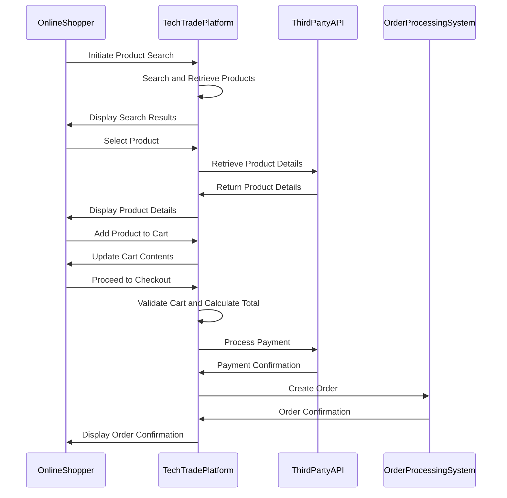

# Class 2: Information Gathering, Business Processes, and User Stories

- [Class 2: Information Gathering, Business Processes, and User Stories](#class-2-information-gathering-business-processes-and-user-stories)
  - [Definitions](#definitions)
  - [Understanding and Analyzing Business Processes](#understanding-and-analyzing-business-processes)
  - [Techniques for extracting relevant information from business processes](#techniques-for-extracting-relevant-information-from-business-processes)
  - [Various Sources of Information for Gathering Client Requirements](#various-sources-of-information-for-gathering-client-requirements)
  - [Requirements Elicitation Techniques != Sources of Information for Gathering Client Requirements](#requirements-elicitation-techniques--sources-of-information-for-gathering-client-requirements)
    - [Requirements Elicitation Techniques](#requirements-elicitation-techniques)
    - [Sources of Information for Gathering Client Requirements](#sources-of-information-for-gathering-client-requirements)
  - [Integration of User Stories into Requirements Gathering](#integration-of-user-stories-into-requirements-gathering)
  - [Connecting User Stories to Business Process Analysis](#connecting-user-stories-to-business-process-analysis)
  - [Mapping Business Processes Using Unified Modeling Language (UML)](#mapping-business-processes-using-unified-modeling-language-uml)
  - [Engaging Stakeholders for Input on Business Processes](#engaging-stakeholders-for-input-on-business-processes)
  - [Commonly Used UML Diagrams in Software Requirements Analysis](#commonly-used-uml-diagrams-in-software-requirements-analysis)
  - [Case Study: Applying Requirements Gathering Techniques in a Real-World Scenario](#case-study-applying-requirements-gathering-techniques-in-a-real-world-scenario)
    - [Diagrams](#diagrams)
      - [Use Case Diagram](#use-case-diagram)
      - [Activity Diagram](#activity-diagram)
      - [Sequence diagram](#sequence-diagram)
  - [Links](#links)

## Definitions

| Term                   | Description                                                                                      |
|------------------------|--------------------------------------------------------------------------------------------------|
| Business Processes     | Involves a series of coordinated activities within an organization to achieve specific goals, create value, and deliver products or services. |
| Analyzing Business Processes | Examining and understanding the structure, interactions, and flow of activities within an organization to identify opportunities for improvement. |
| Software Requirements   | Detailed descriptions of the functionalities and constraints that a software system must fulfill, outlining what the system needs to achieve. |
| User Story             | A concise, user-centric description of a software feature or functionality, typically written in a simple narrative format to express end-user needs. |
| UML (Unified Modeling Language) | A standardized visual modeling language used in software engineering to represent system structures, behaviors, and interactions through various diagram types. |
| Stakeholder            | Individuals or groups who have an interest or influence in a project, system, or organization, and their needs and expectations are crucial considerations in the development process. |

## Understanding and Analyzing Business Processes

Business process analysis involves systematically examining how activities and information flow within an organization to achieve specific goals.

> This process is essential for gaining insights into **how work is done**

1. **Identification of Activities:** Determine individual tasks and responsibilities within a process.
2. **Mapping Workflows:** Visualize the sequence and relationships between different activities.
3. **Roles and Responsibilities:** Define roles and responsibilities to clarify accountability.
4. **Information Flow:** Analyze the generation, processing, and communication of information.
5. **Input and Output Analysis:** Examine required inputs, outputs, and the purpose of each process.
6. **Efficiency and Effectiveness:** Evaluate process efficiency, identifying bottlenecks or redundancies.
7. **Technology Integration:** Assess how technology supports and integrates into processes.
8. **Customer and Stakeholder Impact:** Consider the impact of processes on customers and stakeholders.
9. **Regulatory Compliance:** Ensure processes comply with relevant laws and regulations.
10. **Continuous Improvement Opportunities:** Identify opportunities for optimizing and improving processes.

## Techniques for extracting relevant information from business processes

Utilizing methods to extract pertinent information from existing business processes for analysis and improvement.

- **Process Documentation Review**: Reviewing existing documentation to extract insights into process workflows and components.
- **Observation and Shadowing**: Directly observing and shadowing individuals involved in executing business processes.
- **Interviews with Process Participants**: Conducting interviews with individuals actively engaged in executing or managing the processes.
- **Workshops and Brainstorming Sessions**: Organizing collaborative workshops and brainstorming sessions with stakeholders.
- **Data Analysis**: Analyzing data generated by the business processes to derive meaningful insights.
- **Process Simulation**: Creating simulations to model and understand the behavior of complex processes.
- **Workflow Mapping**: Utilizing visual aids like flowcharts or process maps to map out the step-by-step flow.
- **Systematic Surveys**: Implementing structured surveys to gather quantitative data on process performance.
- **Root Cause Analysis**: Investigating and identifying root causes of issues or inefficiencies within processes.
- **Task Analysis**: Breaking down complex processes into individual tasks for detailed examination.
- **Metrics and Key Performance Indicators (KPIs)**: Using metrics and KPIs to measure and extract performance-related information.
- **Cross-Functional Collaboration**: Involving stakeholders from different functional areas for comprehensive insights.

## Various Sources of Information for Gathering Client Requirements

1. **Client Interviews:** Direct communication with clients to understand their needs, expectations, and preferences.

2. **Surveys and Questionnaires:** Distributing surveys or questionnaires to collect structured feedback and specific information.

3. **Observation:** Actively observing and documenting the client's existing processes, workflows, and challenges.

4. **Document Review:** Analyzing existing documents such as reports, manuals, or other relevant materials provided by the client.

5. **Prototypes and Mockups:** Exploring early visual representations of the solution to gather feedback from clients.

6. **Focus Groups:** Conducting group discussions with representatives from the client's side to gather diverse perspectives.

7. **Workshops and Brainstorming Sessions:** Collaborative sessions to ideate and gather requirements in a creative and interactive manner.

8. **Competitor Analysis:** Studying similar products or services in the market to identify features and functionalities that may be relevant.

9. **Market Research:** Understanding industry trends, market demands, and customer preferences.

10. **Feedback from Customer Support:** Gathering insights from the client's customer support or helpdesk regarding common user issues and requests.

11. **Social Media and Online Reviews:** Monitoring social media platforms and online reviews for customer feedback and preferences.

12. **Regulatory Requirements:** Understanding legal and regulatory standards that may impact the project.

13. **Internal Stakeholder Input:** Gathering insights from employees within the client's organization who may have valuable input.

14. **User Analytics:** Analyzing data from existing systems or tools to understand user behavior and preferences.

15. **Use Cases**: Developing scenarios that describe how users interact with the system, helping to identify functional requirements.

The combination of these sources helps ensure a comprehensive understanding of client requirements and facilitates the development of a solution that aligns with their needs and goals.

## Requirements Elicitation Techniques != Sources of Information for Gathering Client Requirements

### Requirements Elicitation Techniques

- **Definition**: Requirements elicitation refers to the process of **collecting and discovering requirements from stakeholders**.

- **Focus**: This term specifically emphasizes the methods and techniques used to extract information from stakeholders about their needs, expectations, and constraints.

- **Examples of Techniques**:
  - Interviews
  - Surveys and Questionnaires
  - Workshops and Brainstorming
  - Prototyping
  - Observation
  - Document Analysis
  - Use Cases

### Sources of Information for Gathering Client Requirements

- **Definition**: This refers to a broader set of channels or resources from which information related to client requirements can be obtained.

- **Focus**: It encompasses a wide range of sources beyond just elicitation techniques. It includes any means by which relevant information about client requirements can be gathered.

- **Examples of Sources**:
  - Client Interviews
  - Surveys and Questionnaires
  - Observation
  - Document Review
  - Prototypes and Mockups
  - Focus Groups
  - **Competitor Analysis**
  - **Market Research**
  - **Feedback from Customer Support**
  - **Social Media and Online Reviews**
  - **Regulatory Requirements**
  - **Internal Stakeholder Input**
  - **User Analytics**

## Integration of User Stories into Requirements Gathering

Incorporating user stories into the requirements gathering process is a user-centric approach that emphasizes collaboration and simplicity.

1. **User-Centric Approach:**
   - Captures end-user needs and expectations through narrative storytelling.

2. **Collaborative Storytelling:**
   - Involves active contributions from stakeholders in creating user stories.

3. **Simple Language:**
   - Expresses user stories in non-technical, easily understandable language.

4. **As a `[User]`, I Want `[Feature]`, So That `[Benefit]`:**
   - Follows a standard format, specifying user roles, features, and benefits.

5. **Inclusion of Acceptance Criteria:**
   - Outlines conditions for the story's completion through acceptance criteria.

6. **Prioritization and Iterative Development:**
   - Facilitates prioritization based on user importance and supports iterative development.

7. **Flexibility and Adaptability:**
   - Allows for changes in requirements based on user feedback and project evolution.

8. **Story Mapping:**
   - Utilizes story mapping techniques for visual organization and prioritization.

9. **Continuous Customer Involvement:**
   - Involves end-users in story creation and review for continuous feedback.

10. **Traceability to Business Goals:**
    - Ensures user stories align with overall business objectives.

11. **Agile Development Methodologies:**
    - Integral in Agile methodologies for iterative and customer-centric development.

12. **Sprint Planning and Backlog Management:**
    - Guides sprint planning and backlog management sessions for feature prioritization.

## Connecting User Stories to Business Process Analysis

Connecting user stories to business process analysis establishes a link between user-centric narratives and the systematic examination of organizational workflows.

1. **User Stories as Scenarios:**
   - User stories depict user interactions within business processes as scenarios.

2. **Mapping User Activities:**
   - User stories are mapped to specific user activities within business processes.

3. **Aligning Features with Processes:**
   - Features in user stories align with corresponding steps in business processes.

4. **Identifying Process Impact:**
   - Analysis of user stories helps identify impact on existing business processes.

5. **User-Centric Process Enhancements:**
   - Business processes are enhanced based on insights from user stories.

6. **Integration into Process Workflows:**
   - User stories seamlessly integrate into process workflows.

7. **Continuous Validation:**
   - User stories undergo continuous validation against business processes.

8. **Feedback Loop:**
   - User feedback from stories informs iterative improvements in both software and processes.

9. **Cross-Functional Collaboration:**
   - Encourages collaboration between analysts, stakeholders, and development teams.

10. **Prioritizing Features Based on Process Impact:**
    - Features in user stories are prioritized based on their impact on critical business processes.

11. **Enhanced User Experience:**
    - The connection contributes to an enhanced user experience by aligning software with user tasks.

12. **Traceability to Organizational Goals:**
    - Ensures traceability of user stories and processes to overarching organizational goals.

## Mapping Business Processes Using Unified Modeling Language (UML)

Utilizing UML, a standardized visual modeling language, to create graphical representations of business processes.

1. **UML as Visual Modeling Language:**
   - Provides standardized notation for visually modeling systems.

2. **Process Flow Diagrams:**
   - Activity Diagrams depict the flow of activities within a business process.

3. **Entities and Relationships:**
   - Class Diagrams represent entities and their relationships in the process.

4. **Sequence of Activities:**
   - Sequence Diagrams illustrate the chronological sequence of activities.

5. **State Transitions:**
   - State Diagrams show transitions between different states in a process.

6. **Collaboration and Communication:**
   - Collaboration Diagrams represent interactions and communication between elements.

7. **Use Cases:**
   - Use Case Diagrams identify different scenarios and user interactions.

8. **Visualizing Process Structure:**
   - Component Diagrams visualize structural components and relationships.

9. **Interaction and Dependencies:**
   - Dependency relationships highlight dependencies between elements.

10. **UML Modeling Tools:**
    - Specialized tools facilitate the creation and management of UML diagrams.

11. **Enhanced Understanding:**
    - UML enhances understanding of process structure, interactions, and dependencies.

12. **Alignment with UML Standards:**
    - Adheres to standardized UML modeling practices for consistency and compatibility.

## Engaging Stakeholders for Input on Business Processes

Involves actively involving stakeholders in providing input and insights into the analysis and improvement of business processes.

1. **Collaborative Workshops:**
   - Conducting workshops to gather collective insights from stakeholders.

2. **Interviews and Surveys:**
   - Utilizing interviews and surveys to collect individual stakeholder perspectives.

3. **Feedback Sessions:**
   - Organizing sessions for stakeholders to provide real-time feedback on processes.

4. **Requirement Elicitation:**
   - Engaging stakeholders in the elicitation of specific business process requirements.

5. **Iterative Reviews:**
   - Iteratively involving stakeholders in reviews to ensure alignment with expectations.

6. **User Story Workshops:**
   - Conducting workshops to gather user stories related to business processes.

7. **Cross-Functional Collaboration:**
   - Fostering collaboration between stakeholders from different functional areas.

8. **Visual Representations:**
   - Using visual aids to facilitate stakeholder understanding and input.

9. **Prioritizing Stakeholder Needs:**
   - Prioritizing and incorporating stakeholder needs into business process improvements.

10. **Open Communication Channels:**
    - Maintaining open channels for continuous communication and feedback.

11. **Stakeholder Input Analysis:**
    - Analyzing gathered input to inform decisions on optimizing business processes.

12. **Alignment with Organizational Goals:**
    - Ensuring stakeholder input aligns with broader organizational goals and objectives.

## Commonly Used UML Diagrams in Software Requirements Analysis

In the stage of software requirements analysis, several UML (Unified Modeling Language) diagrams are commonly used to capture and communicate different aspects of the system. The most commonly used UML diagrams in this stage include:

- **Use Case Diagrams**: Illustrate the interactions between users and the system, highlighting the various use cases and their relationships.
- **Activity Diagrams**: Depict the flow of activities within a system, helping to model business processes and workflows.
- **Class Diagrams**: Represent the static structure of the system by illustrating classes, their attributes, and relationships between classes.
- **Sequence Diagrams**: Visualize the interactions between objects over time, emphasizing the sequence of messages exchanged during a specific scenario.
- **State Diagrams**: Model the different states of an object or system and the transitions between these states.

## Case Study: Applying Requirements Gathering Techniques in a Real-World Scenario

TechTrade, a growing e-commerce company, is planning a major overhaul of its online platform to enhance user experience and expand its market reach. The project initiation involves gathering comprehensive requirements to ensure the new system aligns with business goals and user expectations.

**TechTrade's Current State**:

- **E-commerce Platform Overview**
  - The existing platform lacks certain features to meet evolving market demands.
  - User feedback indicates issues with navigation, product search, and checkout processes.
- **Stakeholders**
  - Key stakeholders include TechTrade executives, marketing managers, IT specialists, and end-users.

**Requirements Elicitation Techniques Application**:

- **Interviews**: Conduct one-on-one interviews with TechTrade executives to understand overarching business goals and priorities for the new platform.
- **Surveys**: Distribute surveys to existing TechTrade users to collect feedback on pain points, feature preferences, and areas of improvement.
- **Observation**: Observe user interactions with the current platform to identify usability issues and areas requiring improvement.

**Integration of User Stories**:

- Collaborate with the marketing team and IT specialists to develop user stories that encapsulate specific features and functionalities desired by end-users.

**Mapping Business Processes Using UML**:

- Create UML diagrams, including use case diagrams and activity diagrams, to map out the current and desired workflows of key business processes within the TechTrade e-commerce platform.

**Engaging Stakeholders for Input on Business Processes**:

- Conduct collaborative workshops involving TechTrade executives, marketing managers, and IT specialists to gather input on desired changes, improvements, and additional functionalities in business processes.

### Diagrams

#### Use Case Diagram

#### Activity Diagram

#### Sequence diagram

## Links

- [Lucidchart](https://lucid.co/)
- [Wikipedia: Unified Modeling Language](https://en.wikipedia.org/wiki/Unified_Modeling_Language)
- [What is Unified Modeling Language (UML)?](https://www.visual-paradigm.com/guide/uml-unified-modeling-language/what-is-uml/)
- [Unified Modeling Language](https://www.techopedia.com/definition/3243/unified-modeling-language-uml)
- [Lucidchart: UML Use Case Diagram Tutorial](https://www.lucidchart.com/pages/uml-use-case-diagram)
- [Business, User, and System Requirements](https://enfocussolutions.com/business-user-and-system-requirements/)
- [What is the Role-Feature-Reason Template?](https://www.visual-paradigm.com/scrum/user-story-role-feature-reason-template/)
- [How to Map BPMN with User Stories?](https://www.visual-paradigm.com/tutorials/business-process-to-user-stories-mapping.jsp)
- [The Importance of User Stories When Preparing a Software Specification Requirements Document](https://storiesonboard.com/blog/software-specification-requirements)
- [The Difference Between User Stories and Requirements](https://deeprojectmanager.com/user-stories-vs-requirements/)
- [User Stories are Needs Described from the Business Perspective](https://www.scrum.org/resources/blog/user-stories-are-needs-described-business-perspective)
- [User Stories vs Requirements](https://premieragile.com/user-stories-vs-requirements/)
