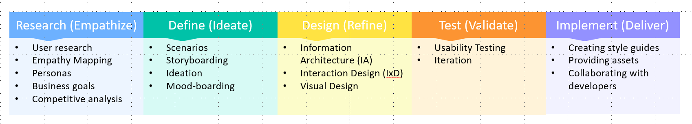

# UI design lifecycle

- [UI design lifecycle](#ui-design-lifecycle)
  - [Design Process](#design-process)
  - [UI Design Lifecycle Stages](#ui-design-lifecycle-stages)
    - [1. Research (Empathize)](#1-research-empathize)
    - [2. Define (Ideate)](#2-define-ideate)
    - [3. Design (Refine)](#3-design-refine)
    - [4. Test (Validate)](#4-test-validate)
    - [5. Implement (Deliver,  Handoff \& Development)](#5-implement-deliver--handoff--development)
    - [Additional Considerations](#additional-considerations)

## Design Process

- **UI Design Process**: Similar to lifecycle, this term describes the sequence of stages involved in UI design.
- **UI/UX Design Process**: This broader term encompasses both User Interface (UI) design and User Experience (UX) design, which focuses on the overall user experience beyond just the interface.

> Both "UI design lifecycle" and "UI design process" are commonly used terms. They essentially mean the same thing

## UI Design Lifecycle Stages

### 1. Research (Empathize)

**Focus**: Gain a deep understanding of the target audience, their needs, and the project goals.

**Activities**:

- **User research**: Conducting interviews, surveys, usability testing, and competitor analysis to understand user behavior, needs, and pain points. User research can include techniques like:
  - **Empathy Mapping**: This collaborative tool helps designers visualize the user's perspective by capturing information about what users say, do, think, and feel.
  - **Personas**: Creating fictional representations of target user groups based on research data. Personas help designers keep user needs in mind throughout the design process.
- **Business goals**: Aligning the design with the overall business objectives and identifying key performance indicators (KPIs).
- **Competitive analysis**: Researching existing solutions in the market to understand best practices and identify opportunities for differentiation.

### 2. Define (Ideate)

**Focus**: Develop a clear understanding of the project scope, user needs, and design direction.

**Activities**:

- **Scenarios**: Creating narratives that describe how users might interact with the interface in different situations. Scenarios help designers think through user flows and identify potential challenges.
- **Storyboarding**: Visually depicting key user journeys through the interface using a sequence of illustrations or sketches. Storyboards can be a great way to communicate design ideas and identify potential usability issues.
- **Ideation**: Brainstorming and generating a wide range of design ideas and solutions. Techniques like sketching, mind mapping, and crazy-8s can be used to encourage creative exploration.
- **Mood-boarding**: Creating a visual collage that captures the desired style, tone, and mood of the interface. Mood-boards help establish a visual direction and inspire design decisions.

### 3. Design (Refine)

**Focus**: Translate concepts and ideas into a concrete and functional UI design.

**Activities**: This stage builds upon the previous stages and includes the core UI design activities mentioned earlier:

- **Information Architecture (IA)**: Organizing content in a logical and user-friendly way.
  - Defining the content hierarchy (how information is categorized and related).
  - Creating sitemaps (visual representations of the content structure).
  - Labeling elements clearly and consistently.
- **Interaction Design (IxD)**: Defining how users will interact with the interface.
  - Developing user flows (visual representations of user journeys through the interface).
  - Wireframing (low-fidelity sketches that outline the basic structure and interaction flows).
  - Prototyping (interactive mockups that simulate the final user experience).
- **Visual Design**: Applying visual elements to create an aesthetically pleasing and user-friendly interface.
  - **Layout**: Defining the overall arrangement of UI elements, including structure (grids, spacing, alignment) and responsiveness (adapting to different screen sizes).
  - **Color & Contrast**: Choosing colors that are visually appealing, accessible, and create clear contrast for readability.
  - **Typography & Readability**: Selecting fonts and styles that are clear, easy to read, and appropriate for the brand identity.
  - **Imagery & Icons**: Utilizing visuals like images and icons to enhance user experience and brand communication.
  - **Visual Hierarchy**: Employing visual cues (size, color, placement) to guide the user's eye and emphasize important information.

### 4. Test (Validate)

**Focus**: Evaluate the usability of the interface and make improvements based on user feedback.

**Activities**:

- **Usability Testing**: Conducting sessions with real users to observe their behavior and identify usability issues.
- **Iteration**: Refining the design based on user feedback and going back to previous stages (Research, Define, Design) as needed.

### 5. Implement (Deliver,  Handoff & Development)

**Focus**: Prepare the design assets and specifications for developers to implement the UI.

**Activities**:

- **Creating style guides**: Documents that define design elements and their usage.
- **Providing assets**: Images, icons, and fonts to developers.
- **Collaborating with developers**: Ensuring accurate implementation.

### Additional Considerations

- **The order of these stages might not always be strictly linear**. Depending on the project and team, there might be some overlap or back-and-forth between stages.
- **The specific tools and techniques used within each stage can vary** based on project needs and individual preferences.
- **Communication and collaboration are crucial throughout the UI design process**. Regular communication between designers, researchers, developers, and stakeholders ensures everyone is aligned on the project goals and user needs.
