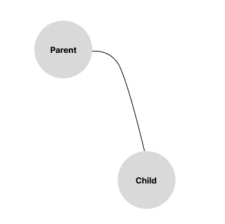
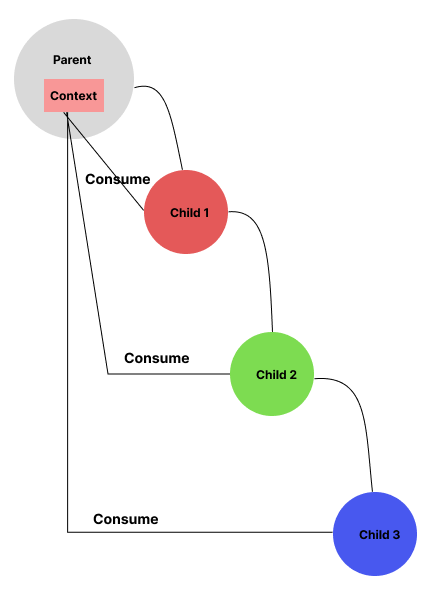

# State Management

- [State Management](#state-management)
  - [State components](#state-components)
  - [State Management Tasks](#state-management-tasks)
  - [State Management Approaches](#state-management-approaches)
    - [Component State Management](#component-state-management)
      - [React hook](#react-hook)
      - [useState](#usestate)
      - [Sharing State Between Components](#sharing-state-between-components)
      - [Passing State from Parent to a Child at the First or Second Level](#passing-state-from-parent-to-a-child-at-the-first-or-second-level)
      - [Passing Stateful Data from a Parent to a Child That Is Deep Within Our Application Tree](#passing-stateful-data-from-a-parent-to-a-child-that-is-deep-within-our-application-tree)
    - [State Management Frameworks](#state-management-frameworks)
      - [Redux \& Flux](#redux--flux)
    - [Comparing Component State and State Management Frameworks](#comparing-component-state-and-state-management-frameworks)

## State components

- The state includes several components:
  - **Application Data**: This is the core data required for the app's operations, such as user profiles, preferences, and items in a shopping cart.
  - **UI State**: This includes the current status of the user interface elements, such as the visibility of dialogs and the values in form fields.
  - **Session State**: Data that lasts for the duration of a user's session, like login status and session-specific settings.
  - **Server State**: Data retrieved from the server, which needs to be kept in sync with the client-side application.
  - **Persistent State**: Data that is stored for long-term use, like settings saved in local storage or cached data.

## State Management Tasks

State management in web applications typically involves several key tasks:

- **Creating State**: Initializing the data that the application will use.
- **Modifying State**: Updating the data in response to user interactions and other events.
- **Generating Computed Values**: Deriving new data based on the current state.
- **Distributing State**: Sharing data among different components within the application.
- **State Synchronization**: Ensuring that stateful data remains consistent with the user interface and across various parts of the application.

## State Management Approaches

Managing state effectively is crucial for building robust web applications. Common state management tasks can be efficiently handled using two popular approaches:

- **Component state**
- **State management frameworks**

### Component State Management

Component State is the most straightforward way to manage state within individual components. It is a built-in feature of many frontend libraries and frameworks, such as React, Vue, and Angular. Key aspects of using component state include:

1. **Local State Management**: Each component manages its own state, making it suitable for simple applications or isolated parts of a larger application.
2. **Ease of Use**: Ideal for beginners due to its simplicity and direct integration with the component lifecycle.
3. **Performance**: Minimizes overhead since the state is only maintained within the component.

#### React hook

> **React hook** is a JavaScript function that allows functional components to use state, lifecycle methods, and other React features.

#### useState

The useState hook in React is used to add state management capabilities to functional components

Here's a simplified version of how useState might be implemented

```javascript
// Simplified implementation of useState hook
function useState(initialValue) {
  // Create a variable to hold the current state value
  let state = initialValue;

  // Create a function to update the state value
  const setState = (newValue) => {
    state = newValue;
    // Trigger re-rendering of the component
    // (this would typically be done differently in a real implementation)
    render();
  };

  // Return an array with the current state value and the function to update it
  return [state, setState];
}
```

With useState Hook:

```javascript
import React, { useState } from 'react';
import { View, Text, Button } from 'react-native';

const CounterWithState = () => {
  const [count, setCount] = useState(0);

  const incrementCount = () => {
    setCount(count + 1);
  };

  return (
    <View>
      <Text>Count: {count}</Text>
      <Button title="Increment" onPress={incrementCount} />
    </View>
  );
};

export default CounterWithState;
```

Without useState Hook:

```javascript
import React from 'react';
import { View, Text, Button } from 'react-native';

const CounterWithoutState = () => {
  let count = 0;

  const incrementCount = () => {
    count += 1;
    console.log(count); // just to demonstrate the change
  };

  return (
    <View>
      <Text>Count: {count}</Text>
      <Button title="Increment" onPress={incrementCount} />
    </View>
  );
};

export default CounterWithoutState;
```

- `useState` takes an `initialValue` as its argument and returns an array containing the current state value (`state`) and a function to update it (`setState`).
- When `setState` is called, it updates the `state` variable with the new value (`newValue`). After updating the state, it typically triggers a re-render of the component. In a real implementation, the re-rendering process would be more sophisticated.
- This simplified version does not handle the re-rendering aspect as it would be handled differently depending on the rendering system being used (e.g., React's reconciliation algorithm).

#### Sharing State Between Components

- Stateful data in applications is typically shared between components
- Stateful data can be passed from a parent component to a first or second-level child component

#### Passing State from Parent to a Child at the First or Second Level



In React, passing state from a parent component to a child component at the first or second level involves simply passing the state variable as a prop to the child component.

```javascript
// ParentComponent.js
import React, { useState } from 'react';
import ChildComponent from './ChildComponent';

const ParentComponent = () => {
  // Define state in the parent component
  const [state, setState] = useState(initialState);

  return (
    <div>
      {/* Pass state as a prop to the child component */}
      <ChildComponent currentState={state} />
    </div>
  );
};

export default ParentComponent;
```

#### Passing Stateful Data from a Parent to a Child That Is Deep Within Our Application Tree



In complex React applications, deeply nested components may require access to shared state. Passing state down through multiple levels of components becomes impractical. To address this, React provides **Context**, which allows data to be shared and consumed by components at any level in the component tree.

**Context** follows a Publish-Subscribe pattern, where data is published by a provider and consumed by subscribing components. When the data in Context is updated, subscribers automatically receive the new value. This mechanism simplifies state management in deeply nested component hierarchies.

```javascript
import React, { createContext, useContext, useState } from 'react';

// Create a context for the shared state
const CountContext = createContext();

// Define a parent component that provides the state
const ParentComponent = () => {
  const [count, setCount] = useState(0);

  return (
    <CountContext.Provider value={{ count, setCount }}>
      <ChildComponent />
    </CountContext.Provider>
  );
};

// Define a child component that consumes the state
const ChildComponent = () => {
  // Access the count state using useContext hook
  const { count, setCount } = useContext(CountContext);

  return (
    <div>
      <p>Count: {count}</p>
      <button onClick={() => setCount(count + 1)}>Increment</button>
    </div>
  );
};

export default ParentComponent;
```

### State Management Frameworks

State Management Frameworks provide more robust solutions for handling state, especially in larger and more complex applications. These frameworks include tools like Redux, Vuex, and MobX.

Key features of state management frameworks include:

1. **Centralized State**: State is stored in a central location, making it easier to manage and share across different components.
2. **Predictable State Changes**: Uses patterns and conventions to ensure state changes are predictable and easier to debug.
3. **Scalability**: Better suited for large-scale applications with complex state management needs.
4. **Middleware and Plugins**: Enhance functionality with middleware and plugins to handle side effects, asynchronous actions, and more.

Here is a list of some libraries that can be used for state management

- [Redux](https://redux.js.org/)
- [Jotai](https://jotai.org/)
- [MobX](https://mobx.js.org/README.html)
- [Recoil](https://recoiljs.org/)
- [Zustand](https://docs.pmnd.rs/zustand/getting-started/introduction)
- [Xstate](https://xstate.js.org/)
- [Tanstack query/react](https://tanstack.com/query/latest/docs/)
- [Preact Signals](https://preactjs.com/guide/v10/signals/)
- [NGRx (based on Redux)](https://ngrx.io/guide/store)
- [Elf](https://ngneat.github.io/elf/)
- [MobX](https://github.com/mobxjs/mobx-angular)
- [TanStack query/angular](https://tanstack.com/query/latest/docs/framework/angular/overview)

#### Redux & Flux

**Redux** is based on the principles of **Flux architecture**, which was originally developed by Facebook for managing application state in JavaScript web applications. **Flux** introduced a unidirectional data flow pattern, where data flows in a single direction through the application, making it easier to understand and debug.

Redux adopts many concepts from Flux, such as having a single source of truth (the store) and using actions to describe state changes. However, Redux simplifies Flux by providing a more centralized and predictable approach to managing application state.

Key principles of Redux include:

- **Single Source of Truth**: All application state is stored in a single JavaScript object called the store.
- **State is Read-Only**: The only way to change the state is by dispatching actions, which are plain JavaScript objects describing the change.
- **Changes are Made with Pure Functions**: Reducers are pure functions that take the current state and an action, and return the new state.
- **Unidirectional Data Flow**: Data flows in a single direction through the application, making it easier to understand and reason about.

Overall, Redux provides a predictable and maintainable way to manage state in complex JavaScript applications, making it a popular choice for managing state in React applications.

### Comparing Component State and State Management Frameworks

When deciding between component state and state management frameworks, consider the following:

- **Complexity**: Component state is suitable for simpler applications, while state management frameworks are better for complex applications.
- **Scalability**: Frameworks provide better scalability and organization for large-scale applications.
- **Ease of Use**: Component state is easier to implement and understand for beginners.
- **State Sharing**: Frameworks offer more efficient ways to share state across multiple components.
