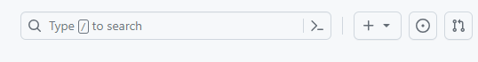
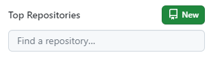
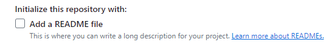

# Class 2: Installation and Configuration with GitHub

- [Class 2: Installation and Configuration with GitHub](#class-2-installation-and-configuration-with-github)
  - [Installation and Configuration with GitHub](#installation-and-configuration-with-github)
    - [Installing Git](#installing-git)
    - [Creating a GitHub Account](#creating-a-github-account)
    - [Key Points](#key-points)
  - [Configuring Tools and User Interface](#configuring-tools-and-user-interface)
    - [Command Line Configuration](#command-line-configuration)
  - [Creating First Repository in GitHub and Cloning Locally](#creating-first-repository-in-github-and-cloning-locally)
    - [Creating a Repository on GitHub](#creating-a-repository-on-github)
    - [Cloning the Repository Locally](#cloning-the-repository-locally)
    - [Key aspects of cloning](#key-aspects-of-cloning)
  - [Updating Local Repo and Pushing Updates to Server](#updating-local-repo-and-pushing-updates-to-server)
    - [Updating the Readme File and Viewing Changes in VSCode](#updating-the-readme-file-and-viewing-changes-in-vscode)
    - [Staging Changes Using VSCode](#staging-changes-using-vscode)
    - [Committing Changes Using VSCode](#committing-changes-using-vscode)
    - [Pushing Changes to the Server Using VSCode](#pushing-changes-to-the-server-using-vscode)
    - [Explanation of Steps](#explanation-of-steps)

## Installation and Configuration with GitHub

### Installing Git

- **Download Git**
  - Visit the official [Git website](https://git-scm.com/)
  - Locate the "**Download**" button and select the appropriate installer for your operating system (Windows, macOS, or Linux).
  - Follow the on-screen instructions to complete the installation.
- **Verify Installation**
- Open a terminal (Command Prompt on Windows, Terminal on macOS or Linux).
- Type `git --version` and press Enter to ensure Git is installed successfully. You should see the installed version.

### Creating a GitHub Account

- Visit [GitHub](https://github.com/)
- Sign Up
  - On the GitHub homepage, click on the "Sign up" button.
  - Enter a valid email address, create a strong password, and choose a unique username for your GitHub account.
  - Click on the "Create account" button.
- Email Verification
  - GitHub will send a verification email to the provided email address.
  - Open your email and click on the verification link to confirm your account.
- Complete Your Profile

### Key Points

- Ensure you choose a strong and secure password for your GitHub account.
- Use an email address that you regularly check, as GitHub communication will be linked to this address.
- Emphasize the significance of unique credentials to enhance account security.

## Configuring Tools and User Interface

### Command Line Configuration

- Open your terminal (Command Prompt on Windows, Terminal on macOS/Linux).
- Use the following commands to set your global Git configuration

```bash
git config --global user.name "Your Name"
git config --global user.email "your.email@example.com"
```

## Creating First Repository in GitHub and Cloning Locally

### Creating a Repository on GitHub

- Navigate to GitHub
- Sign In
- Create a New Repository
  - Click on the "+" sign at the **top right** and choose "New repository."
  - 
  - **Or** you may use green new button from the **dashboard**
  - 
  - Provide a **repository name**, **optional description**
  - choose visibility settings (Public or Private)
  - Initialize this repository with a README if you want to start with an initial file.
  - 
  - Click on the "Create repository" button
  - 

### Cloning the Repository Locally

> Cloning refers to the process of creating a local copy of a remote repository

- Copy Repository URL
- Open Terminal/Command Prompt
- Use the following command to clone the repository locally
- `git clone <repository_url>`
- Paste the URL you copied in place of `<repository_url>`.
- Navigate to Repository
- `cd <repository_name>`
- Replace `<repository_name>` with the name of your repository.

### Key aspects of cloning

- **Creating a Copy**: Cloning creates an identical copy of the repository, allowing you to work with the project's code and history locally.
- **Remote Connection**: The cloned repository remains connected to the original or remote repository. This connection enables you to fetch updates, push changes, and synchronize your local copy with the remote version.
- **Full Version History**: The cloned repository retains the entire version history, including all commits and branches. This comprehensive history is essential for tracking changes and collaborating with others.
- **Offline Work**: Once cloned, you can work on the project even when offline. This is particularly useful for developers who may not always have a continuous internet connection.
- **Collaborative Development**: Cloning is a fundamental step in collaborative development workflows. Each team member can have their own local copy, make changes, and later synchronize those changes with the central repository.

## Updating Local Repo and Pushing Updates to Server

### Updating the Readme File and Viewing Changes in VSCode

1. Open VSCode and navigate to your local repository.
2. Make changes to the README file, perhaps adding information about your project or making edits.
3. Use the Source Control tab in VSCode to view the changes. VSCode provides a visual representation of the differences between the current and previous versions.

### Staging Changes Using VSCode

1. Select the files you want to include in the next commit by staging them. This can be done by clicking the "+" button next to the file in the Source Control tab.
2. Staging prepares the changes for the upcoming commit. It's like telling Git, "These are the changes I want to include in the next snapshot."

### Committing Changes Using VSCode

1. Add a commit message that succinctly describes the changes you made. This provides a clear record of what each commit accomplishes.
2. Committing captures a snapshot of the changes at that moment, creating a checkpoint in your version history.

### Pushing Changes to the Server Using VSCode

1. Finally, push the committed changes to the remote repository on GitHub using the "Push" command in VSCode.
2. Pushing updates the remote repository with your local changes, making them accessible to other collaborators.

### Explanation of Steps

- **Updating Readme:** Modifying files locally reflects your work on the project.
- **Viewing Changes:** The diff view in VSCode visually represents the differences between the current and previous versions.
- **Staging:** Selecting specific files for the next commit.
- **Committing:** Creating a snapshot of the staged changes with a descriptive message.
- **Pushing:** Updating the remote repository with your committed changes.
