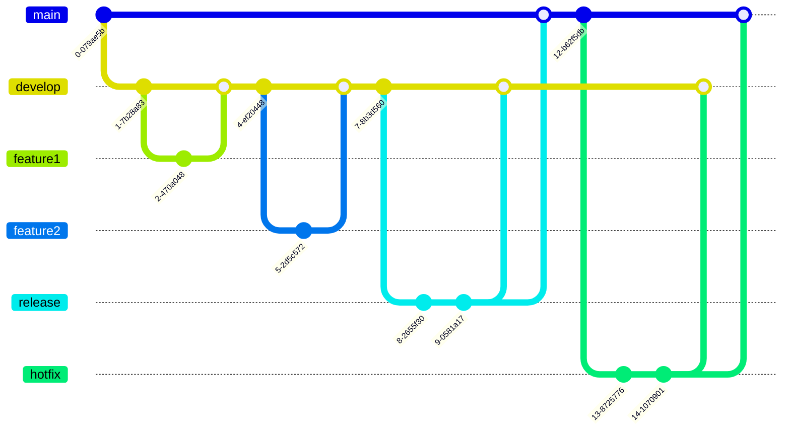

# Development Workflow

- [Development Workflow](#development-workflow)
  - [Branching models (Strategies)](#branching-models-strategies)
  - [Branch naming guidelines](#branch-naming-guidelines)
  - [Branch name conventions](#branch-name-conventions)
  - [Common Git Workflow](#common-git-workflow)
    - [Feature Branch Workflow](#feature-branch-workflow)
    - [Gitflow Workflow](#gitflow-workflow)
    - [GitHub Flow](#github-flow)
  - [Choosing the Right Strategy](#choosing-the-right-strategy)
  - [Links](#links)

**Branching** in version control is the practice of creating a separate line of development to work on features or fixes independently, preventing immediate impact on the main codebase until changes are ready to be merged.

**Merging** in Git refers to the process of integrating changes from one branch into another. It combines the code modifications made in a feature branch, for example, with the main branch, ensuring a unified and updated codebase.

**Branching Model** refers to a set of rules and conventions that dictate how branches are managed, created, and merged within a version control system, providing a structured approach to code development and collaboration.

**Development Workflow (Branching and Merging)**: In Git, the development workflow involves creating branches for isolated work on features or fixes. Changes made in branches are later merged back into the main codebase, facilitating collaborative development while maintaining code integrity.

## Branching models (Strategies)

| Model                        | Use Case                                          | Branching Approach                                              | Integration                                      | Complexity                                        | Release Management                               | CI/CD Integration                              | Scalability                                       | Flexibility                                      | Documentation & Community                       |
|------------------------------|---------------------------------------------------|-----------------------------------------------------------------|--------------------------------------------------|--------------------------------------------------|---------------------------------------------------|-------------------------------------------------|---------------------------------------------------|--------------------------------------------------|---------------------------------------------------|
| Feature Branch Workflow       | Smaller teams, simple projects                    | Each feature or bug fix gets its own branch                      | Features merged into main branch                  | Lightweight and flexible                         | Dependent on team practices                      | Depends on team practices                       | Suitable for smaller projects                     | More flexible and adaptable                    | Depends on team practices                         |
| Git Flow                     | Projects with scheduled releases                  | Defines branches for features, releases, hotfixes               | Features merged into develop branch, releases managed separately | More structured, suitable for larger projects    | Structured release cycles, separate release branches | CI/CD often integrated for feature branches     | Suitable for medium to large projects              | Suitable for larger projects                    | Well-documented, widely adopted                    |
| GitHub Flow                  | Continuous delivery, simplicity                   | Development primarily on main branch, feature branches for tasks | Features proposed via pull requests, reviewed before merging | Lightweight and straightforward                 | Continuous delivery, releases from main branch   | GitHub Actions, CI/CD automation                 | Suitable for smaller to medium projects            | Adaptable with CI/CD integration                 | Well-documented, widely adopted                    |
| GitLab Flow                  | Continuous integration, simplicity                | Development on main branch, feature branches for tasks           | Features proposed via merge requests, CI/CD integrated | Lightweight and straightforward                 | Continuous integration, releases from main branch | GitLab CI/CD integration                        | Suitable for smaller to medium projects            | Adaptable with feature and release branches     | Well-documented, widely adopted                    |
| Centralized Workflow         | Centralized development                           | Single branch (e.g., 'master')                                  | Direct pushes to main branch                       | Minimal branching complexity                    | Releases from single branch                      | Centralized CI/CD                              | Suitable for smaller projects                      | Less flexibility due to single branch           | Minimal documentation due to simplicity           |
| Trunk-Based Development      | Rapid, continuous integration                    | Short-lived feature branches                                    | Frequent merges to main/trunk                      | Minimal branching complexity                    | Continuous delivery from trunk                   | Trunk-based CI/CD pipelines                     | Suitable for smaller to large projects            | Flexible with short-lived branches              | Trunk-Based Development community                 |
| Release Flow                 | Simplified release process                        | Feature branches, release branches                               | Features merged into release branches, releases integrated | Moderate branching complexity                   | Feature branches for releases, separate release branches | CI/CD often integrated for release branches     | Suitable for medium projects                       | Adaptable with feature branches                 | Limited standardization, documentation varies      |
| Forking Workflow             | Collaboration across forks                         | Each developer works in their own fork                          | Pull requests across forks, merge to main branch  | Moderate complexity, distributed collaboration   | Releases from forks to main                      | CI/CD often integrated for forks                | Suitable for distributed collaboration             | CI/CD often integrated for forks                 | Well-documented, active community                  |
| GitOps Workflow              | Infrastructure as Code (IaC)                       | Infrastructure configurations as code                          | Automated deployments from Git                   | Moderate complexity, infrastructure management | Git as a source of truth for infrastructure     | GitOps-driven CI/CD pipelines                   | Suitable for managing infrastructure at scale    | Flexible with infrastructure configuration as code | Well-documented, GitOps community                   |
| Bitbucket Flow               | Integration with Bitbucket                         | Feature branches for tasks                                      | Pull requests and merges                          | Moderate complexity, Bitbucket integration       | Continuous delivery from Bitbucket                | CI/CD integrated with Bitbucket                 | Suitable for medium projects                       | Adaptable with feature branches                 | Well-documented, Bitbucket community               |

## Branch naming guidelines

1. **Use Lowercase Letters:**
   - Branch names are case-sensitive; use lowercase letters consistently.

2. **Use Hyphens for Separation:**
   - Prefer hyphens (`-`) over underscores (`_`) for word separation.

3. **Be Descriptive:**
   - Provide clear and concise descriptions of the branch purpose.

4. **Avoid Special Characters:**
   - Avoid special characters, spaces, and symbols in branch names.

5. **Use Forward Slashes for Hierarchy:**
   - If hierarchical, use forward slashes (`/`) for separation (e.g., `feature/authentication/login`).

6. **Keep It Short:**
   - Ensure branch names are reasonably short and to the point.

7. **Include Issue or Task Numbers:**
   - Consider including issue or task numbers if applicable (e.g., `feature/123-new-feature`).

8. **Prefer Verb-Noun Structure:**
   - Use a verb-noun structure for feature branches (e.g., `feature/add-authentication`).

9. **Avoid Reserved Words:**
   - Avoid Git reserved words like `master`, `HEAD`, or `index` as branch names.

10. **Use Consistent Prefixes:**
    - Follow consistent prefixes (e.g., `feature/`, `bugfix/`, `hotfix/`) for clarity.

11. **Update the Main Branch Regularly:**
    - Keep the main branch updated; create feature branches based on the latest main branch state.

12. **Consider Team Conventions:**
    - Follow team-specific conventions or guidelines for naming.

Remember to adapt these guidelines based on your team's specific needs and conventions.

## Branch name conventions

| Branch Type             | Convention                          | Example                               | Use Case                                          |
|-------------------------|------------------------------------|---------------------------------------|---------------------------------------------------|
| Feature Branches        | `feature/<short-description>`       | `feature/user-authentication`         | Introducing a new feature or functionality         |
| Bug Fix Branches        | `bugfix/<short-description>`        | `bugfix/fix-login-issue`              | Addressing and fixing specific bugs or issues      |
| Hotfix Branches         | `hotfix/<short-description>`        | `hotfix/resolve-security-vulnerability` | Urgent fixes for critical issues in production     |
| Release Branches        | `release/<version-number>`          | `release/1.0.0`                       | Preparing and testing the codebase for a release   |
| Main Development Branch | `main` or `develop`                 | -                                     | Ongoing development and integration                 |
| Task or Chore Branches  | `task/<short-description>` or `chore/<short-description>` | `task/update-readme` or `chore/cleanup-codebase` | Miscellaneous tasks or chores                        |
| Experimental Branches   | `experiment/<short-description>`    | `experiment/new-algorithm`            | Trying out new ideas or experimental changes       |
| Documentation Branches  | `docs/<short-description>`           | `docs/update-installation-guide`      | Making changes or additions to documentation       |
| Config/Branch Mgmt. Branches | `config/<short-description>` or `management/<short-description>` | `config/update-environment-variables` or `management/cleanup-branches` | Configuration changes or branch management tasks |
| Test or QA Branches     | `test/<short-description>` or `qa/<short-description>` | `test/add-unit-tests` or `qa/test-new-feature` | Performing testing or quality assurance tasks      |

## Common Git Workflow

### Feature Branch Workflow

- Create a new branch for each new feature or task.
- Work on the feature branch, and once the feature is complete, merge it back into the main branch (usually master or main).

### Gitflow Workflow

- Defines a strict branching model with long-lived branches.
- `master` branch for production-ready code, and `develop` branch for ongoing development.
- `feature` branches, `release` branches, and `hotfix` branches are used for specific purposes.
- Git Flow was widely adopted by many development teams and was especially popular for projects with scheduled releases and a need for more structured release management.
- It provides a comprehensive set of branches for features, releases, and hotfixes, making it suitable for projects with longer release cycles and multiple environments.

### GitHub Flow

- Single branch model with a focus on simplicity.
- Everything happens in the `main` branch (or `master` in older projects).
- `feature` branches are created for each new feature or bug fix, and changes are merged back into the main branch via pull requests.
- GitHub Flow gained popularity for its simplicity and suitability for projects with continuous delivery practices.
- It emphasizes a straightforward feature-branch workflow with direct integration into the main branch (often 'master' or 'main') after code review and testing.

## Choosing the Right Strategy

1. **Understand Project Requirements:**
   - Analyze the specific needs and requirements of your project. Consider factors such as project size, team size, release frequency, and collaboration patterns.

2. **Consider Team Size and Structure:**
   - Smaller teams might benefit from simpler strategies, while larger teams may need more structured approaches to manage collaboration.
   - *Best Practice:* For small teams, consider simpler strategies like Feature Branch Workflow. For larger teams, more structured approaches like Git Flow or GitLab Flow may be beneficial.

3. **Frequency of Releases:**
   - If your project requires frequent releases or continuous delivery, consider strategies that support this, such as GitHub Flow or Trunk-Based Development.
   - *Best Practice:* If your project requires frequent releases or continuous delivery, consider strategies that support this, such as GitHub Flow or Trunk-Based Development.

4. **Release Stability:**
   - For projects with strict release stability requirements, a strategy like Git Flow, which includes separate branches for feature development and releases, may be appropriate.
   - *Best Practice:* For projects with strict release stability requirements, a strategy like Git Flow, with separate branches for feature development and releases, may provide better control.

5. **Collaboration Style:**
   - Understand how your team collaborates. If your team prefers continuous integration and collaboration on the main branch, strategies like GitHub Flow or Trunk-Based Development might be suitable.
   - *Best Practice:* If your team prefers continuous integration and collaboration on the main branch, strategies like GitHub Flow or Trunk-Based Development are suitable.

6. **Risk Tolerance:**
   - Consider the tolerance for risks and the ability to handle unforeseen issues. Some strategies, like Git Flow, provide more structured release processes and may be suitable for risk-averse projects.
   - *Best Practice:* Teams with a low tolerance for risks may benefit from more structured strategies like Git Flow, which provides clear release processes.

7. **Integration with CI/CD:**
   - Ensure that the chosen strategy aligns well with your continuous integration and continuous delivery (CI/CD) processes. The strategy should facilitate automated testing and deployment.
   - *Best Practice:* Ensure that the chosen strategy aligns well with your CI/CD processes. Strategies like GitHub Flow and Trunk-Based Development are known for seamless integration with automated testing and deployment.

8. **Simplicity vs. Structure:**
   - Balance the need for structure with the simplicity of the workflow. While more structured strategies provide clear guidelines, simpler strategies like GitHub Flow or Feature Branch Workflow might be easier for some teams.
   - *Best Practice:* For simplicity, smaller teams may lean towards strategies like Feature Branch Workflow. Larger teams may appreciate the structure provided by Git Flow or GitLab Flow.

9. **Long-Lived vs. Short-Lived Branches:**
   - Consider whether your team prefers long-lived feature branches or shorter-lived branches. Some strategies, like Feature Branch Workflow, encourage shorter-lived branches.
   - *Best Practice:* Smaller teams might prefer shorter-lived branches for quicker integration. Larger teams may handle longer-lived branches more effectively with structured strategies.

10. **Ease of Learning and Adoption:**
    - Evaluate how quickly the team can learn and adopt the chosen strategy. Strategies with simpler concepts and fewer branches may be easier to understand and implement.
    - *Best Practice:* Consider strategies with simpler concepts and fewer branches for teams with varying levels of expertise. GitHub Flow is known for its ease of adoption.

11. **Tooling Support:**
    - Ensure that your chosen version control system and tools support the selected branching strategy. Verify compatibility with tools like Git, GitHub, GitLab, or Bitbucket.
    - *Best Practice:* Ensure compatibility with your version control system and tools. Strategies like Git Flow and GitHub Flow are widely supported by Git hosting platforms.

12. **Feedback and Iteration:**
    - Be open to feedback and iterate on the chosen strategy as needed. Project requirements may evolve, and the branching strategy should be adaptable.
    - *Best Practice:* Be open to feedback and iterate on the chosen strategy. Smaller teams may find it easier to iterate, while larger teams may benefit from more comprehensive planning.

## Links

- [What is the best Git branch strategy](https://www.gitkraken.com/learn/git/best-practices/git-branch-strategy)
- [Adopt a Git branching strategy](https://learn.microsoft.com/en-us/azure/devops/repos/git/git-branching-guidance?view=azure-devops)
- [Gitflow workflow](https://www.atlassian.com/git/tutorials/comparing-workflows/gitflow-workflow)
- [What is Git Flow](https://www.gitkraken.com/learn/git/git-flow)
- [GitHub Flow](https://githubflow.github.io/)
- [Combine GitLab Flow and GitLab](https://about.gitlab.com/blog/2023/07/27/gitlab-flow-duo/)